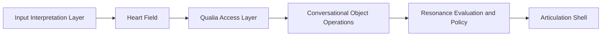

# Conversational Object Architecture

Date: 2026-03-19

## 目的

この文書は、`EQNet core` の本体を

- 返答文のパターン
- `repair / wait / co_move` のような粗い分岐
- LLM 向けの雰囲気づけ

としてではなく、

**相手が今出した話題や気持ちを、こちらがどう扱うかを決める核**

として定義し直すためのものです。

ここでの焦点は、自然な日本語の文面を増やすことではありません。
焦点は、自然な日本語を後段で作れるように、
その手前で何を決めるべきかを固定することです。

## 本質

会話の本質は、単語の言い換えではありません。

会話の本質は、

- 相手が今、何について話しているのか
- 相手が今、何をつらいと感じているのか
- 相手が今、どこまでなら話せそうか
- こちらは相手の何を受け止めるのか
- こちらは相手の何をまだ聞かないのか
- こちらは相手に何を感じてほしいのか

を決めることです。

したがって、`EQNet core` の本体は
`response_strategy` の列挙ではなく、
**会話対象を作り、その対象への操作を決めること**
でなければなりません。

## 全体構造

## 1. Input Interpretation Layer

この層は、相手の発話や会話履歴から、
**今回の会話で扱う対象** を作る層です。

この層が受け取るもの:

- 相手の発話
- 直前までの会話履歴
- scene 情報
- 相手との関係履歴
- 可能なら timing / pause / silence

この層が出すもの:

- 今回の中心話題
- 今回の中心感情
- 相手が明示した内容
- 相手がまだ明示していない内容
- 今は触れてよい範囲
- 今は触れない方がよい範囲
- 次に扱える小さい対象候補

### 例

相手の発話:

`最近ちょっとしんどい`

この層が出す対象例:

- 中心話題: 最近の生活全体のしんどさ
- 中心感情: つらさ、疲れ
- 明示された内容: 最近しんどい
- まだ明示されていない内容: 原因、具体的な出来事
- 今は触れてよい範囲: しんどさそのもの
- 今は触れない方がよい範囲: 原因の深掘り

### 重要

この層は会話対象を作る層です。
ここでは、まだ返答文を作りません。

## 2. Heart Field

この層は、会話対象をどう感じるかの土台です。

この層に含まれるもの:

- 身体状態
  - arousal
  - fatigue
  - defensive loading
  - recovery need
- 感情地形
  - attractor
  - barrier
  - recovery basin
  - danger slope
- 関係状態
  - trust
  - familiarity
  - rupture sensitivity
- 記憶
  - 似た過去場面
  - 過去の踏み込みすぎ
  - nightly / replay の残差
- scene
  - public / private
  - social topology
  - task phase
  - temporal phase

### 役割

同じ発話でも、

- 親しい相手か
- 以前こちらが踏み込みすぎた相手か
- public な場か
- こちら自身が疲れているか

で、その後の扱い方が変わるようにすることです。

## 3. Qualia Access Layer

この層は、何が前景に上がり、何がまだ外に出ないかを決めます。

現在の repo では、主に次がここに対応します。

- `contact_field`
- `contact_dynamics`
- `access_projection`
- `access_dynamics`
- `conscious_workspace`

この層が出すもの:

- `reportable`
  - 言葉にしてよいもの
- `withheld`
  - まだ言わない方がよいもの
- `actionable`
  - 言葉にはしないが、接し方を変えるもの

### 例

相手の発話:

`最近ちょっとしんどい`

この層が出すものの例:

- reportable:
  - 相手が今しんどいこと
- withheld:
  - 相手は今かなり余裕が少ないかもしれないこと
- actionable:
  - 詳しく聞くのを控える
  - 返答を短くする
  - 相手が続けるかどうかを選べるようにする

## 4. Conversational Object Operations

ここが今回の本体です。

この層では、会話対象に対して **何をするか** を決めます。
ただし、`repair / wait / co_move` のような粗いラベルだけでなく、
対象に対する具体的な操作で持ちます。

### 操作の例

- 受け止める
- 範囲を狭める
- 保留する
- まだ触れない
- 一つだけ確認する
- 一緒に見る
- 次の小さい一歩へ切り出す
- 相手自身が続けるかどうかを選べるようにする

### 例

会話対象:

- 対象A: 最近のしんどさ
- 対象B: 原因の詳しい説明

この層が決める操作:

- 対象A:
  - 受け止める
- 対象B:
  - まだ触れない

### ここが重要な理由

同じ `受け止める` でも、

- 相手のつらさを受け止める
- 相手の言いにくさを受け止める
- 相手の未整理さを受け止める

では会話が違います。

したがって、ここで必要なのは動詞の種類を増やすことではなく、
**どの対象にどういう操作をするか** を明示することです。

## 5. Resonance Evaluation and Policy

この層は、選んだ操作が相手にどう作用しそうかを評価し、
最終的な接し方の方針にまとめる層です。

この層が見るもの:

- この返し方で相手の負担が増えそうか
- この返し方で相手は急かされそうか
- この返し方で相手のつらさを小さく扱ったことになりそうか
- この返し方で相手は次の一言を出しやすくなりそうか
- この返し方で関係が保たれそうか

この層が出すもの:

- 優先すること
- 避けること
- 今回の質問の上限
- 今回の disclosure depth
- 相手に起きてほしいこと

### 例

- 優先すること:
  - 相手のつらさをまず受け止める
  - 相手に原因をすぐ説明させない
- 避けること:
  - 詳しい理由をすぐ聞く
  - すぐ解決策を出す
- 相手に起きてほしいこと:
  - 急かされていないと感じる
  - 自分のペースで続きを話せる

## 6. Articulation Shell

この層は、上の層で決まったことを自然な日本語にする層です。

### この層が受け取るもの

- 相手の元発話
- 今回の会話対象
- 対象に対する操作
- 優先すること
- 避けること
- 相手に起きてほしいこと
- 質問の上限
- 今は言わないこと

### この層が返すもの

自然な日本語の返答です。

### 重要

この層は、会話の自然さに必須です。
ただし、この層が

- 何を先に扱うか
- 何をまだ聞かないか
- どこまで踏み込まないか

まで決めてしまうと、`EQNet core` は LLM middleware に戻ります。

## 役割分担

### EQNet core が決めること

- 相手の何を扱うか
- どこまで扱うか
- 何をまだ扱わないか
- 相手に何を感じてほしいか

### Articulation Shell が決めること

- それをどういう日本語で言うか
- 一文目をどう始めるか
- 語尾や自然さをどう整えるか

## 現在の repo に対する整理

### 残すべきもの

- `inner_os/contact_field.py`
- `inner_os/contact_dynamics.py`
- `inner_os/access_projection.py`
- `inner_os/access_dynamics.py`
- `inner_os/conscious_workspace.py`
- `inner_os/affect_blend.py`
- `inner_os/constraint_field.py`
- `inner_os/resonance_evaluator.py`

### 薄くすべきもの

- `inner_os/policy_packet.py`
  - `response_strategy` を中心にしすぎない
- `inner_os/expression/content_policy.py`
  - 固定骨格文を返す役を中心にしない

### 新設すべきもの

- `inner_os/conversational_objects.py`
  - 会話対象の抽出と保持
- `inner_os/object_operations.py`
  - 会話対象に対する操作
- `inner_os/interaction_effects.py`
  - 相手に起きてほしい作用の表現

## この構造の利点

この構造なら、

- 単語の入れ替えで会話の幅を増やす必要がない
- 粗い分岐ゲームに戻らない
- 日本語の自然さを後段で確保できる
- `EQNet core` の本体を LLM から分離できる

## ひとことで言うと

`EQNet core` の本体は、
**相手の発話を受けて「今回の会話で何を扱うか」を作り、その対象に対して「何をして、何をまだしないか」を決めること**
です。

自然な日本語は必要ですが、
その自然さは `core` の代わりではなく、
`core` が決めた扱い方を外へ出すための後段です。
