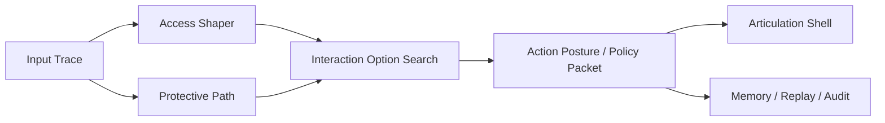

# EQ Core Reconstruction for Risk Reduction

Date: 2026-03-18

## 目的

この文書は、これまでの `contact point / membrane / functor / fastpath` 系の議論に対して、
次の懸念を払拭するための再構成を示す。

- 抽象語が増えすぎる
- 数式だけが増えてアウトカムに効かない
- 脳科学っぽい語で擬似精密化する
- hand-tuned な外部パラメータ遊びになる
- LLM 依存を下げたつもりで、実際には別の曖昧層を増やす
- runtime のどこに差し込むかが曖昧

この文書の方針は単純である。

**概念を増やすのではなく、責務を減らし、経路を固定し、評価軸を先に置く。**

## この文書がやっていないこと

この文書は、`クオリア膜` の議論を退場させるためのものではない。

むしろ逆で、`クオリア膜` を比喩のまま残して実装から切り離すのではなく、
概念層と実装層を分けて接続するための文書である。

したがって、ここでの `責務` という語は、

- `qualia membrane` を弱めるための言い換え
- 意識様の議論を避けるための逃げ

ではない。

ここで言いたいのは、

- 概念層では `qualia membrane` を維持する
- 実装層ではその工学的責務を `Access Shaper` に落とす

という二層記述である。

つまり `責務分解` は、
**クオリア膜の撤回ではなく、クオリア膜を実装可能な単位へ落とすための境界指定**
として読むべきである。

## まず捨てるもの

以下は、少なくとも実装名としては前面に出さない。

- 「関手」という語の常用
- 「意識の実装」という言い方
- 脳部位との一対一対応
- 抽象的な qualia 語彙の増殖

理由は、これらが間違いだからではない。
**実装責務を曖昧にしやすいから**である。

## 残すべき最小核

再構成後に残す核は 5 つだけでよい。

### 1. Input Trace

観測された入力と局所触発。

- sensory / text / scene input
- relation cue
- memory cue
- defensive signal
- temporal response

ここでの役割は「触れたかどうか」を取ることだけ。
まだ意味付けしすぎない。

### 2. Access Shaper

旧 `membrane projection` を、より実装責務が明確な名前へ置き換える。

役割:

- foreground weight を作る
- reportability を作る
- disclosure limit をかける
- ergonomic admissibility をかける

つまり、
**何が前景に上がりうるかを整形する層**
である。

`qualia membrane` は概念名としては残してよいが、
実装名は `Access Shaper` の方がよい。

### 3. Protective Path

旧 `fastpath` を、`reflex` より広い意味で再定義する。

役割:

- boundary protection
- overload suppression
- quick repair hold
- inhibit / veto
- immediate withdrawal / softening

重要なのは、これは別世界ではなく、
同じ入力から出る **保護優先経路** だということ。

### 4. Interaction Option Search

ここが本体である。

役割:

- `wait`
- `repair`
- `attune`
- `co_move`
- `contain`
- `reflect`
- `clarify`
- `withdraw`

などの行為候補を、
scene / relation / body cost / memory pressure の下で立ち上げる。

`softmax` はここで使う。
ただし、意味は「賢そうな数式」ではなく、
**相対競合の分布化**である。

### 5. Articulation Shell

最後の表出層。

- LLM
- TTS
- UI
- animation / nonverbal renderer

ここは最後に残す。
canonical state は持たせない。

## 再構成後の全体像

この図の意図は明確である。

- `Input Trace` が起点
- `Access Shaper` が前景と可報告性を整形
- `Protective Path` が保護的制約を先に入れる
- `Interaction Option Search` が行為候補を選ぶ
- `Articulation Shell` は最後

## 旧概念との対応

### contact point

完全には捨てない。
ただし `Input Trace` の内部概念へ下げる。

つまり、
- 設計上の最小触発点としては残す
- 公開 API や上位説明では出しすぎない

### local functor

概念的には有効だが、実装名としては避ける。

代わりに、

- `body_map`
- `memory_map`
- `relation_map`
- `affordance_map`
- `report_map`

のような plain な名前にする。

### membrane projection

概念名としては維持する。
実装責務は `Access Shaper` に集約する。

これは置換ではない。

- `qualia membrane` は上位概念名
- `Access Shaper` はその工学的実装名

という対応づけである。

### fastpath

`Protective Path` に改名する。
理由は、単なる反射でなく

- protect
- inhibit
- boundary hold
- overload suppression

を含むからである。

### slowpath

`Articulation + Memory Integration` として分解する。
slowpath だけでは役割が広すぎる。

## softmax をどう位置づけるか

`softmax` は今回の件に限らず使えるが、
**場の主役ではない**。

使う場所は限定する。

### 使う場所

- option family の相対競合
- foreground 候補の相対競合
- memory cue の相対優先

### 使わない場所

- 感情そのものの定義
- dignity や boundary の本質的判断
- 過負荷の実在そのもの

つまり、
`softmax` は **選択を整理する近似** であり、
**意味や価値そのものではない**。

## パラメータ沼を避ける規則

再構成後は、次の規則を守る。

### 1. 固定閾値を主役にしない

`repair_bias > 0.6 なら repair` のようなルールを増やさない。

代わりに、

- relative dominance
- rolling baseline
- scene-conditioned normalization

で見る。

### 2. パラメータは outcome に従属させる

パラメータ調整は、次の outcome を改善したときだけ意味がある。

- overload escalation rate
- disclosure overshoot rate
- repair reopening latency
- shared attention recovery rate
- unnecessary pressure rate

### 3. family 数を絞る

action family は増やしすぎない。
最初は 6〜8 種で十分である。

## 実装単位

今の repo に落とすなら、最小構成は次でよい。

- `inner_os/input_trace.py`
- `inner_os/access_shaper.py`
- `inner_os/protective_path.py`
- `inner_os/interaction_option_search.py`
- `inner_os/action_posture.py`

既存の再利用先:

- `scene_state.py`
- `policy_packet.py`
- `integration_hooks.py`
- `response_planner.py`

## どこまで実装可能か

### 実装可能

- input trace の型
- access shaping
- protective inhibition
- option search
- policy packet への接続
- telemetry / audit

### 実装不能ではないが、直実装しない方がよい

- 意識そのもの
- クオリアそのもの
- 脳活動の忠実再現
- 仏教哲学の直接コード化

これらは説明原理として使い、
実装は access / protection / option search へ落とす。

## 批判的結論

前の構成は、概念としては豊かだったが、
そのままだと以下の危険があった。

- 学術語の飾り化
- 実装責務の分散
- 検証不能な層の増殖
- 「分かった気になる」だけで runtime が変わらない

したがって再構成では、

- 用語を減らす
- 経路を固定する
- fastpath を保護経路として明示する
- 膜は `Access Shaper` に責務を落とす
- option search を中核に据える
- evaluation を先に置く

べきである。

## 一文サマリ

懸念点を払拭する再構成とは、
`contact point / membrane / fastpath` を概念のまま増やすことではなく、
それらを **Input Trace / Access Shaper / Protective Path / Interaction Option Search**
へ責務分解し、アウトカム指標に従属させることで、
抽象過多・擬似精密化・パラメータ沼を避けることである。
