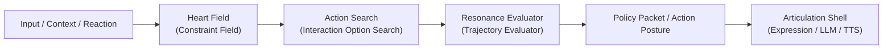
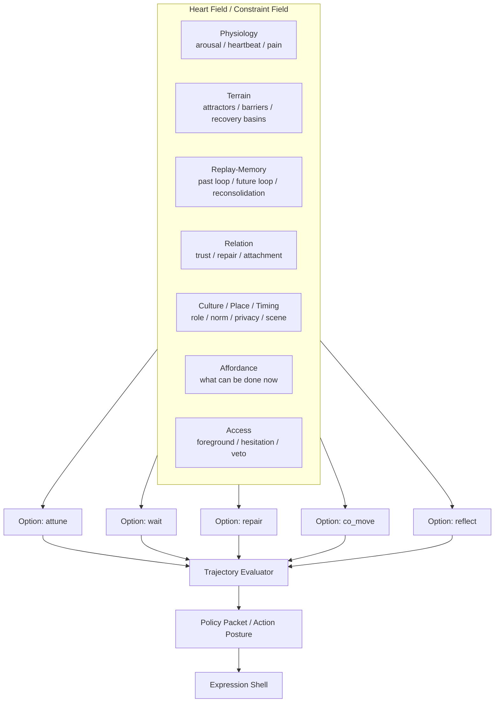

# Interaction Option Search Architecture

Date: 2026-03-18

## Purpose

This document clarifies a more serious alternative to a single linear planner.

The project needs a structure where:

- internal terrain and body cost matter
- relation, culture, and place matter
- multiple action possibilities can exist at once
- the language shell does not become the true decision-maker

This document names that structure and defines how candidate actions should
arise.

## Naming

Two naming layers are useful.

### Concept Names

- `Heart Field`
- `Action Search`
- `Resonance Evaluator`
- `Articulation Shell`

These are suitable for posters, concept notes, and broader explanations.

### Implementation Names

- `Constraint Field`
- `Interaction Option Search`
- `Trajectory Evaluator`
- `Expression Shell`

These are better for code and technical documents.

Both sets refer to the same structure.

## Core Idea

The system should not decide by passing all state into one planner.

Instead:

1. the current scene and internal field define what kinds of action are
   viable
2. a small number of interaction options arise
3. those options are evaluated against relation, repair, safety, and shared
   world formation
4. only then is a policy packet emitted

This is not a "committee voting on text".

It is a field-conditioned search over small interaction options.

## Architecture



Expanded:



## Scene State

Action options should not arise from inner state alone.

They must arise from inner state embedded in a scene.

The minimum scene state should include:

- `place_mode`
- `privacy_level`
- `social_topology`
- `task_phase`
- `temporal_phase`
- `norm_pressure`
- `safety_margin`
- `environmental_load`
- `mobility_context`
- `scene_family`

This means:

- public vs private space changes the admissible option set
- parting vs arrival changes timing
- coordination vs repair changes which options become viable
- culture and norm pressure change distance and disclosure

## Why "strong" and "weak" should not be fixed thresholds

The system should avoid:

- `if repair_bias > 0.6: repair`
- `if future_pull > 0.5: co_move`

Those become external parameter tricks.

Instead, each action family should receive a relative activation within the
current field.

Example:

```text
repair = 0.29
wait = 0.24
attune = 0.18
co_move = 0.11
reflect = 0.09
...
```

What matters is not an absolute number.

What matters is:

- relative dominance
- local baseline
- scene-conditioned viability
- boundary veto

## How 3–8 options should arise

The project should not emit a fixed menu every turn.

Options should arise in four steps.

### 1. Scene narrows the action families

Examples:

- `reverent_distance` suppresses deep approach
- `shared_world` promotes co-move and narrow clarification
- `repair_window` promotes repair and hold-presence

### 2. The field activates families

Each family receives a raw activation from:

- physiology
- terrain
- replay / memory
- relation
- culture / place / timing
- affordance
- access

### 3. Relative weights are normalized

Use a distribution such as softmax to convert raw activation into relative
weights.

That lets multiple families remain partially alive at once.

### 4. Candidate count emerges from coverage

Instead of a hard threshold, select families until:

- at least 3 are represented
- no more than 8 are kept
- cumulative relative weight passes a coverage target

This means candidate count emerges from the field distribution.

## Scientific Position

This architecture is not unusual.

It is close to:

- option selection in hierarchical control
- action competition in robotics and cognitive architectures
- model predictive selection over short horizons
- active inference style policy evaluation

The difference is that the evaluation field is explicitly emotional,
relational, cultural, and scene-sensitive.

## Repository Direction

The repository already has parts of this:

- terrain and access
- relation and memory
- policy packet and action posture
- live interaction regulation

What is added by this architecture is:

- explicit `SceneState`
- explicit `Interaction Option Search`
- later, a proper `Trajectory Evaluator`

## Current Minimal Code Hooks

The first structural pieces now exist in:

- `inner_os/scene_state.py`
- `inner_os/interaction_option_search.py`

These do not yet replace runtime planning.

They provide a concrete place where:

- scene-aware action family activation
- relative weighting
- candidate emergence

can be expressed without collapsing back into one linear planner.
