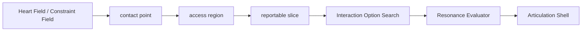

# Qualia Contact-Access Model

Date: 2026-03-18

For a membrane-only explanation that focuses on projection, admissibility, and
foreground shaping without the whole contact-to-path architecture, see:

- `docs/core/qualia_membrane_projection_model.md`

## 目的

この文書は、`クオリア膜` を

- 工学的に無理のない形で
- `EQ core` の既存構成と接続し
- `感情地形`
- `グリーン関数 / インパルス応答`
- `意識アクセス`
- `softmax による競合整理`

と一緒に扱うための最小モデルを定義する。

ここで重要なのは、クオリア膜を

- 「脳のどこかにある二次元の実体」

として固定しないことと、

- 「全部をそのまま言語化する報告器」

として薄くしないことの両方を避けることである。

## 核心

`クオリア膜` は、分散した内部状態のうち

- どこがまず局所的に触発され
- どこまでまとまりとして前景化され
- そのうちどこが実際に報告・行為・記憶へ出るか

を分けて考えるための access モデルとして扱う。

この文書では、これを 3 段に分ける。

1. `contact point`
2. `access region`
3. `reportable slice`

## 三段モデル

### 1. Contact Point

`contact point` は、内部場の中で最初に局所的な触発が起きた点である。

これはまだ

- 完成した意味
- 完成した感情ラベル
- 完成した言語

ではない。

むしろ、

- 何かが触れた
- 何かが刺さった
- 何かが気になった
- 何かが引っかかった

という最小単位に近い。

工学的には、

- 局所極大
- 高勾配点
- ignition hotspot

のようなものとして扱える。

### 2. Access Region

`access region` は、複数の contact point やその周辺がまとまりとして前景化した領域である。

ここで初めて

- ある感じ
- ある方向性
- ある意味のまとまり

が生まれる。

この段階では、まだ fully reportable とは限らない。

しかし、

- 注意が向いている
- 行為を押している
- memory write を押している

という意味で access 可能になっている。

### 3. Reportable Slice

`reportable slice` は、access region のうち

- 言語化される
- 行為姿勢へ反映される
- 記憶として固定される

部分である。

つまり、意識経験の全体がそのまま外へ出るのではなく、

- access region の一部だけが
- 現在の boundary / hesitation / do_not_cross に従って
- 外部表現へ切り出される

と考える。

## 図

## 感情地形との関係

`感情地形` は、どこが触れやすいか、どこへ流れやすいかを決める場である。

内部状態を `x(t)`、感情地形を `Φ(x,t)` とすると、

- `contact point` は `Φ` の局所的な形
- `access region` は `Φ` の中で現在アクセス可能な帯域
- `reportable slice` はその中でさらに public に切り出された部分

と見なせる。

感情地形は、点を直接言葉にするのではなく、

- attractor
- barrier
- recovery basin
- danger slope

によって、どの contact point が生き残るかを左右する。

## グリーン関数 / インパルス応答との関係

刺激 `u(t)` は、そのまま意識に入るのではなく、まず応答核 `G` を通って内部状態へ広がる。

\[
\xi(t)=\int G(t-\tau)u(\tau)\,d\tau
\]

この `ξ(t)` が

- 地形を歪め
- contact point を立ち上げ
- access region の重みを変える

と考える。

したがって、

- 同じ刺激でも
- habituation や recovery によって応答核が変わると
- 立ち上がる contact point も変わる

ことになる。

これは「同じ言葉でも今日は刺さらない」「普段は平気でも今日は触れすぎる」を自然に含められる。

## softmax との関係

softmax はクオリアそのものではない。

softmax は、

- 複数の contact point 候補
- 複数の access region 候補
- 複数の行為 / 想起 / report 候補

が競合したとき、それらの相対優勢を分布として表すための整理層である。

\[
p_i = \frac{e^{a_i/\tau}}{\sum_j e^{a_j/\tau}}
\]

ここで `a_i` は、

- terrain
- replay / memory
- relation
- physiology
- scene
- access pressure

から計算された候補活性である。

重要なのは、softmax が内面を作るのではなく、

- すでに存在している分散した内面のうち
- 何が今相対的に勝つか

を読むだけだということである。

## 意識アクセスとの関係

この文書では、意識アクセスを

- 全内部状態の完全な自己説明

ではなく、

- access region のうち、現在 foreground になった部分への選択的アクセス

として定義する。

したがって `クオリア膜` は、

- 脳の一地点の膜

よりも、

- 分散状態の中で access 可能になった部分集合

として扱うほうが自然である。

ただし、工学的には最初の触発点を捨てない。

つまり、

- 局所的には `contact point`
- foreground 的には `access region`
- 表出的には `reportable slice`

というスケール差で両立させる。

## 脳活動との対応づけ

このモデルは、脳の局所部位と 1 対 1 に対応させるためのものではない。

対応づけるなら、

- 解剖学的部位
- ネットワーク結合
- 状態空間の位置

のうち、主に

- 分散活性の状態空間
- その競合とアクセス

に対応づけるのが自然である。

したがって、

- `感情地形` = 分散活性の状態空間幾何
- `グリーン関数` = 刺激伝播の時間核
- `クオリア膜` = そのうち access 可能になった部分集合
- `softmax` = 競合の読み出し近似

という関係になる。

## EQ core での位置づけ

この三段モデルは、`EQ core` では次の位置に入る。

ここで重要なのは、

- `reportable slice` の前にすでにクオリア的な触発があること
- `Articulation Shell` は最後の表出器であって、クオリアの生成器ではないこと

である。

## 実装上の読み替え

現在の repo に落とすなら、まず次のように読める。

- `contact point`
  - terrain ignition
  - memory cue ignition
  - roughness / defensive residue
  - shared attention の局所変化

- `access region`
  - foreground candidates
  - current focus
  - interaction option candidates
  - relation / scene による可視化帯域

- `reportable slice`
  - `reportable_facts`
  - `interaction_policy_packet`
  - `action_posture`
  - `content_sequence`

ただし、これは暫定の読み替えであり、最終的には

- contact point の局所生成
- access region の領域化
- reportable slice の切り出し

をより明示的に分ける方が望ましい。

## まとめ

`クオリア膜` は、次のように再定義できる。

- 最初は局所的な `contact point` として触発が立つ
- それがまとまって `access region` になる
- その一部だけが `reportable slice` として表出される

この整理により、

- 初期の「接触点」イメージ
- 現在の「アクセス可能部分集合」イメージ

を対立させずに統合できる。

また、

- 感情地形
- グリーン関数
- 意識アクセス
- softmax による競合整理

も同じ系の中で位置づけやすくなる。
